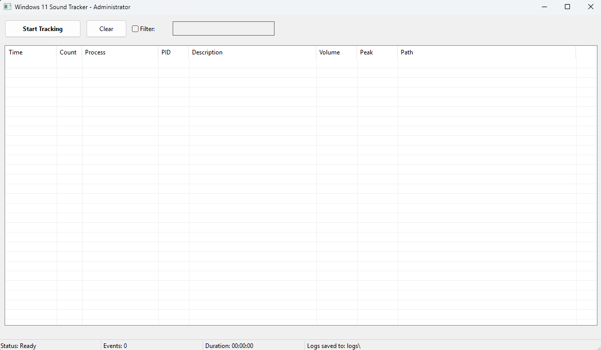

# Windows 11 Sound Tracker

A powerful Windows application that tracks and logs ALL system sounds in real-time, helping you identify exactly which program is making sounds on your computer.


## 🎯 Features

- **Real-Time Sound Monitoring**: Tracks every sound from every application
- **Detailed Information**: Shows process name, PID, file path, and volume levels
- **Smart Event Batching**: Groups multiple events from the same process within the same minute
- **System Sounds Detection**: Catches Windows notifications, USB connections, and keyboard sounds
- **Automatic CSV Logging**: Continuously logs to CSV file in logs folder
- **Click-to-Copy**: Click any row to copy all its data to clipboard
- **System Tray Support**: Minimize to system tray for background monitoring
- **Filtering**: Search for sounds from specific applications
- **Session-Based Logging**: Each tracking session creates a new timestamped CSV file

## 📸 Screenshots



The application shows a real-time list of all sounds with columns for:
- **Time**: When the sound occurred (HH:MM format)
- **Count**: Number of events batched together (same process, same minute)
- **Process**: Application name
- **PID**: Process ID
- **Description**: Human-readable description
- **Volume/Peak**: Sound levels (0-100%)
- **Path**: Full executable path

## 🚀 Quick Start

### Download Pre-built Release
1. Download `SoundTracker.exe` from the [Releases](https://github.com/IronAdamant/windows_sound_tracker/releases) page
2. Double-click to run (will request Administrator privileges)
3. Click "Start Tracking" to begin monitoring

### Build from Source

**Requirements:**
- Windows 10/11
- Visual Studio 2022 (Community Edition or higher)
- CMake 3.20+ (included with Visual Studio)

#### Option 1: Visual Studio GUI

1. **Clone the repository:**
   ```bash
   git clone https://github.com/IronAdamant/windows_sound_tracker.git
   ```

2. **Open in Visual Studio:**
   - Launch Visual Studio 2022
   - Select "Open a local folder"
   - Navigate to the cloned repository folder
   - Visual Studio will automatically detect CMakeLists.txt

3. **Build the project:**
   - Select `x64-Release` from the configuration dropdown
   - Go to `Build → Build All` (or press `Ctrl+Shift+B`)
   - The executable will be in `out\build\x64-Release\bin\SoundTracker.exe`

#### Option 2: VS Code with CMake Extension

1. **Install extensions:**
   - Install "C/C++" extension by Microsoft
   - Install "CMake Tools" extension by Microsoft

2. **Open the project:**
   - Open VS Code
   - File → Open Folder → Select the repository folder

3. **Configure and build:**
   - Press `Ctrl+Shift+P` → "CMake: Configure"
   - Select "Visual Studio Community 2022 Release - amd64"
   - Press `Ctrl+Shift+P` → "CMake: Build"
   - Or use the CMake sidebar for build options

#### Option 3: Command Line (Developer PowerShell)

1. **Open Developer PowerShell for VS 2022:**
   - From Start Menu → Visual Studio 2022 → Developer PowerShell

2. **Build with CMake:**
   ```powershell
   cd path\to\windows_sound_tracker
   mkdir build
   cd build
   cmake .. -G "Visual Studio 17 2022" -A x64
   cmake --build . --config Release
   ```

3. **The executable will be in `build\bin\Release\SoundTracker.exe`**

#### Building a Portable Version

For a standalone executable with no dependencies:

```powershell
# In Developer PowerShell
cmake .. -G "Visual Studio 17 2022" -A x64 -DCMAKE_MSVC_RUNTIME_LIBRARY="MultiThreaded"
cmake --build . --config Release -- /p:RuntimeLibrary=MT
```

## 💻 Usage

1. **Start the Application**: Double-click SoundTracker.exe (auto-elevates to Administrator)
2. **Begin Monitoring**: Click the "Start Tracking" button
3. **View Events**: Watch the real-time list populate with sound events
4. **Filter Results**: Check "Filter" and enter a process name to focus on specific apps
5. **Stop Tracking**: Click "Stop Tracking" to end the session and save logs
6. **Background Mode**: Minimize to system tray for unobtrusive monitoring

### Log Files

- **Automatic Logging**: All sound events are automatically saved to CSV files
- **Location**: Logs are stored in the `logs` folder in the same directory as the executable
- **File Format**: `sound_log_YYYY-MM-DD_HHMMSS.csv` (one file per tracking session)
- **Access Logs**: The status bar shows the current log file path during tracking

### Keyboard Shortcuts
- **Double-click system tray icon**: Restore window
- **Right-click system tray icon**: Quick menu

## 📊 CSV Log Format

All tracking sessions are automatically saved as CSV files with the following format:

```csv
Timestamp,EventCount,ProcessID,ProcessName,ProcessPath,Description,SessionName,VolumeLevel,PeakLevel,IsSystemSound
2025-01-05 14:23:45.123,1,12345,Discord.exe,C:\...\Discord.exe,Discord Voice/Message,,65%,72%,No
```

**Column Descriptions:**
- **Timestamp**: Full date and time when the sound occurred
- **EventCount**: Number of sounds batched together (same process, same minute)
- **ProcessID**: Windows Process ID
- **ProcessName**: Executable name
- **ProcessPath**: Full path to the executable
- **Description**: Human-readable description of the sound source
- **SessionName**: Audio session name (if available)
- **VolumeLevel**: Current volume percentage (0-100%)
- **PeakLevel**: Peak audio level percentage (0-100%)
- **IsSystemSound**: Whether it's a Windows system sound

## 🔧 Technical Details

- **Audio API**: Windows Core Audio APIs (WASAPI)
- **GUI Framework**: Native Win32 API
- **Language**: C++17
- **Privileges**: Requires Administrator access for system-wide monitoring

### How It Works
1. Enumerates all audio endpoints using `IMMDeviceEnumerator`
2. Monitors audio sessions via `IAudioSessionManager2`
3. Tracks volume changes and peak levels
4. Identifies process information for each sound
5. Batches events occurring within the same minute

## 🤝 Contributing

Contributions are welcome! Please feel free to submit a Pull Request.

### Development Setup
1. Fork the repository
2. Create your feature branch (`git checkout -b feature/AmazingFeature`)
3. Commit your changes (`git commit -m 'Add some AmazingFeature'`)
4. Push to the branch (`git push origin feature/AmazingFeature`)
5. Open a Pull Request

## 📝 License

This project is licensed under the MIT License - see the LICENSE file for details.

## 🙏 Acknowledgments

- Windows Core Audio APIs documentation
- Win32 API reference
- Community feedback and testing
- Created with the assistance of AI (Claude) for code development and optimization

## ⚠️ Privacy Note

This tool monitors audio metadata only (which programs are making sounds), not the actual audio content. No audio is recorded or transmitted.

## 🐛 Known Issues

- Default Windows application icon (custom icon welcome via PR!)
- Settings are not persistent between sessions

## 📞 Support

- **Issues**: Please use the [GitHub Issues](https://github.com/IronAdamant/windows_sound_tracker/issues) page
- **Questions**: Start a [Discussion](https://github.com/IronAdamant/windows_sound_tracker/discussions)
- **Security**: See SECURITY.md for reporting vulnerabilities